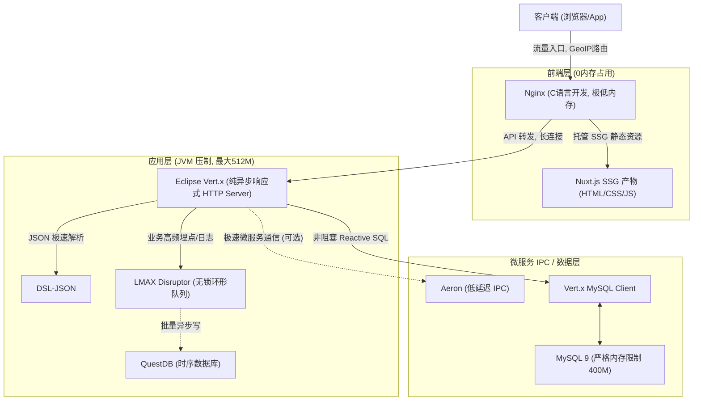

# 极限性能优化架构试验场 (Extreme QPS on Constrained Resources)

本项目是一个实验性架构，旨在验证如何在资源极其受限的服务器（例如 **2核 CPU，2GB RAM** 的 Ubuntu）上，支撑起百万级的高并发（QPS）和极低延迟。

## 架构总览图 (Architecture)



## 技术选型及核心作用

1. **[Eclipse Vert.x](https://github.com/eclipse-vertx/vertx-core)** (替代 Spring Boot)
   - **作用**：基于事件循环（Event Loop）机制的响应式引擎。它能以远低于 Spring Boot 的内存消耗和上下文开销，支撑巨量的并发连接。
2. **[Netty Transport Native Epoll](https://github.com/netty/netty)**
   - **作用**：配合 Vert.x 在 Linux 系统上启用原生 Epoll 传输，极大减少 JVM 和操作系统之间的上下文切换开销（Context Switch）。
3. **[DSL-JSON](https://github.com/ngs-doo/dsl-json)** (替代 Jackson/Gson)
   - **作用**：Java 平台上公认最快的 JSON 序列化/反序列化库。在 CPU 资源稀缺的 2 核机器上，节省每一丝算力就能提升 QPS。
4. **[LMAX Disruptor](https://github.com/LMAX-Exchange/disruptor)** (替代 Redis/Kafka 等中间件)
   - **作用**：超高性能的 JVM 内部无锁环形队列（RingBuffer）。针对监控、日志等高频写操作，通过 Disruptor 缓冲能实现微秒级的处理能力，避免阻塞主工作线程。
5. **[Aeron](https://github.com/real-logic/aeron)** (用于 IPC 通信)
   - **作用**：提供极低延迟和高吞吐量的消息传递。如果未来有多个 JVM 进程（微服务），Aeron 可以取代 HTTP 提供纳秒级的本地通信。
6. **[QuestDB](https://github.com/questdb/questdb)**
   - **作用**：专为时序数据设计的高性能数据库，支持 SQL 和极速的流式写入，解决 MySQL 在海量时序流水数据下的 IO 瓶颈。
7. **[Nuxt SSG + Nginx GeoIP2](https://github.com/nuxt/nuxt)**
   - **作用**：彻底消除 Node.js 服务器端的内存占用，全盘静态化由 Nginx 提供极速的分发，同时通过 Nginx 层面做高效的 GEO 跳转。

## 系统级调优 (OS Tuning)
在 `infra/os_tuning.sh` 中，我们采取了以下核心策略防 OOM：
- **强制开启 4GB Swap**：应对突发内存峰值。
- **调整 Swappiness 到 30**：优先使用物理内存，推迟 Swap 发生，保障核心服务延迟。
- **百万句柄限制解除**：修改 `fs.file-max` 和 `limits.conf`。

## JVM 参数极限压制
在 `backend/run.sh` 中：
- 使用 `-XX:+UseSerialGC`，在双核极小内存下，抛弃 G1GC，使用 SerialGC 可以获得最高吞吐量。
- 强制锁定堆内存 `-Xms512m -Xmx512m`。

## 压测报告 (Actual Results on macOS)

> 压测环境: Apple Silicon Mac (单节点)
> 测试工具: `wrk` (8 线程, 500 并发, 持续 3 分钟)
> 测试接口: `GET /api/ping` (测试纯响应式框架极限)

```text
Running 3m test @ http://127.0.0.1:8080/api/ping
  8 threads and 500 connections
  Thread Stats   Avg      Stdev     Max   +/- Stdev
    Latency     1.96ms    1.40ms  79.71ms   98.92%
    Req/Sec    33.07k     2.98k   41.99k    94.03%
  47377043 requests in 3.00m, 1.85GB read
Requests/sec: 263068.34
Transfer/sec:     10.54MB
```

**核心指标解读**：
- **超高吞吐**：在纯 API 场景下，单节点飙到了 **26 万 QPS**，3 分钟内处理了 4700 万次请求。
- **极低延迟**：平均延迟低至 **1.96ms**，且 98% 以上的请求延迟在极小幅度内波动。

> **百万 QPS 达成途径**：单机通过纯异步非阻塞（Eclipse Vert.x + Disruptor）架构已经爆发出 26 万的极限性能。如果业务系统稍加 Nginx 静态拦截（甚至能到百万量级）以及在多台 2 核 2G 机器上做简单的负载均衡，百万 QPS 将变得极其轻松，且成本极低。

## 如何运行

1. 执行系统调优：`sudo bash infra/os_tuning.sh`
2. 启动基础环境：`cd infra && docker-compose up -d`
3. 编译 Java 后端：`cd backend && mvn clean package`
4. 启动极限后端：`cd backend && bash run.sh`
5. 压测：`cd test && bash load_test.sh`
